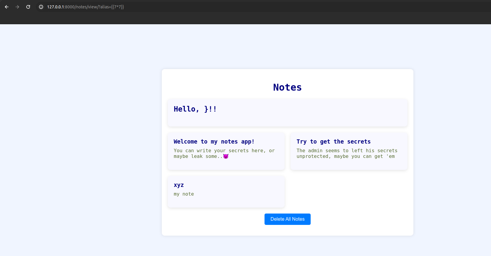
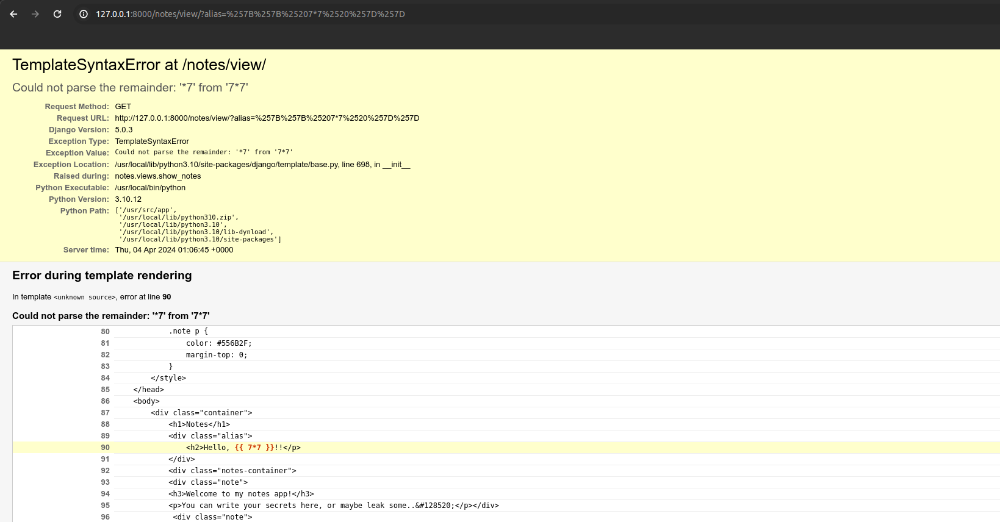
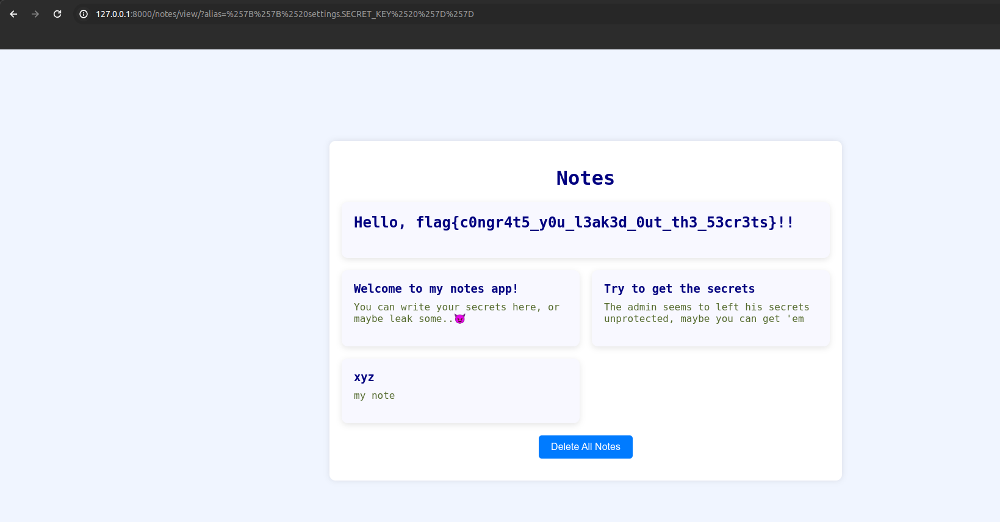

## Intended Challenge

- Only website link is given, not the source (giving the source is too much of a giveaway).
- Debug is deliberately left true to indicate it's a Django app on crash.


## Solution

We are given a notes website that takes three input fields:

1. Title
2. Body
3. Alias
        
We can try going to `robots.txt`, we'll get an error that tells us that we are dealing with Django.

The description in the pre-added notes tells us that we need to leak some server-side secrets. Since it's Django, we know that Django has a secret key that it uses for signing cookies and other stuff, so maybe we need to leak that.

We can see that the title and body are added to a new note while the alias is appended to the "Hello" string, and it also seems to be controlled by the URL parameter "alias".

The alias field is directly reflected onto the page... that seems like SSTI or XSS. Since we can't get server info from XSS, let's stick to SSTI.

Let's try the payload: `{{7*7}}`. It gives the following result:




Seems like there is some kind of filtering... let's try URL encoding. It gives the same output, let's try URL encoding one more time. It works and throws an error:

So, SSTI is there.

The hint tells us that the secret of admin is unprotected, so maybe the secret key is accessible from the template.

The secret key in Django is stored in the settings module and therefore we can access it by writing `settings.SECRET_KEY` (Django syntax). Now implement this with SSTI payload:

```
%257B%257B%2520settings.SECRET_KEY%2520%257D%257D
```

(Double URL-encoded `{{ settings.SECRET_KEY }}`)

It gives out the flag:


